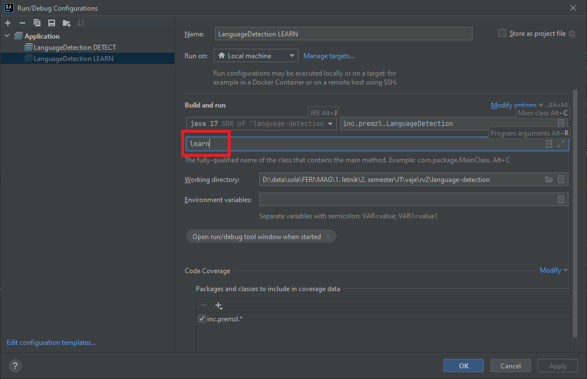
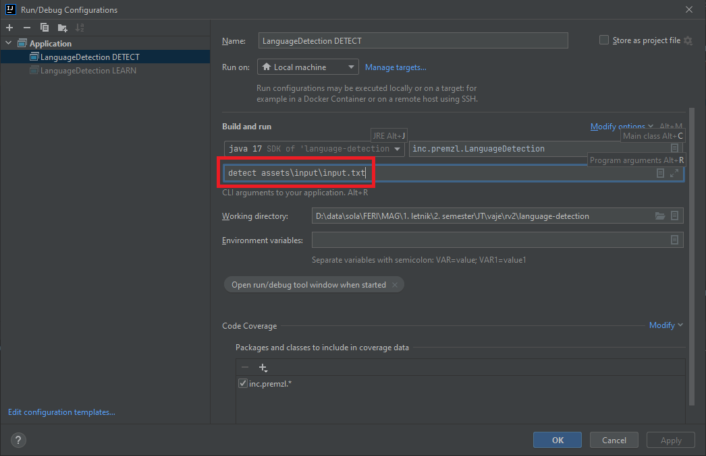

# Language detection

**Application for detecting the language of the inputted text**

## Usage

1. Create a folder called `assets` in the root directory
    1. Create three subfolders inside `assets` called `corps` `input` `solved`
2. Inside the subfolder `corps` place language corps (*.txt* format) in different languages
    1. Call the *.txt* file of each language `<language-name>.txt` (example slovenian corp: `slovenian.txt`)
3. Inside the subfolder `input` create a file and insert the desired text to detect
    1. For ease of use, we will call it `input.txt`
4. Create a new configuration for learning languages
    1. In program arguments add `learn`
       
5. Create a new configuration for language detection
    1. In program arguments add `detect`, and the path of the input file, in our
       example `detect assets\\input\\input.txt`
       

The folder structure should now look like this:

```
root
├── assets
│   ├── corps
│   │   ├── english.txt
│   │   ├── slovenian.txt
│   │   ├── german.txt
│   │   ├── italian.txt
│   │   └── ...
│   ├── input
│   │   └── input.txt
│   └── solved
│ ...
...
```

Upon running the `learn` configuration, the `solved` directory will get filled.

**And the expected output of `detect` should be the language of the input text.**

## Theory

### Learning

1. Each language corp has special characters removed (example: `()[]{}` etc.)
    1. **NOTE** SPECIAL CHARACTERS **DO NOT** INCLUDE LETTERS (example: `čšž` etc.)
2. Text is then split into words, and character N-grams of sizes 2, 3 and 4 are calculated.
3. N-grams get organized by number of appearances and the most popular 300 get written inside the language's respective
   file inside the `solved` directory.

### Detection

1. The most popular N-grams of each language get read from inside the `solved` directory.
2. N-grams of the input text get calculated the same way as above, and the first 300 get used.
3. Each N-gram gets compared to each of the N-grams from each of the languages.
4. A sum is calculated for every language, and the language with the lowest sum is the detected language.